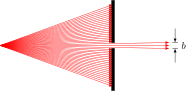
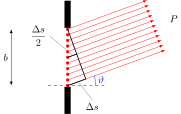

# List of tikz images
## aperture.svg

~~~.tex
\documentclass[crop,tikz]{standalone}

\tikzset{>=latex}
\usetikzlibrary{calc}

\begin{document}
\begin{tikzpicture}
  % source
  \foreach \d in { -20,-19,...,-2 } { \draw[->,red] (0,0) -- +(\d:{4/cos(\d)}); };
  \foreach \d in {  20, 19,..., 2 } { \draw[->,red] (0,0) -- +(\d:{4/cos(\d)}); };
  \foreach \d in { -1, 0, 1       } { \draw[->,red] (0,0) -- +(\d:6); };
  % aperture
  \draw[fill] (4-0.05,-1.6) rectangle (4+0.05,-0.1);
  \draw[fill] (4-0.05, 0.1) rectangle (4+0.05, 1.6);
  % rays
  \draw[]   ($( 1:6)+(0.1,0)$) -- +(0.2,0);
  \draw[]   ($(-1:6)+(0.1,0)$) -- +(0.2,0);
  \draw[->] ($( 1:6)+(0.2, 0.5)$) -- +(0,-0.5);
  \draw[->] ($(-1:6)+(0.2,-0.5)$) -- +(0, 0.5);
  \node[right] at (0:6.3) {$b$};
\end{tikzpicture}
\end{document}
~~~
## diffraction-single-slit.svg

~~~.tex
\documentclass[crop,tikz]{standalone}

\tikzset{>=latex}
\usetikzlibrary{calc}

\begin{document}
\begin{tikzpicture}
  % slit
  \draw[fill] (-0.1, 1.05) rectangle (0.1, 2.0);
  \draw[fill] (-0.1,-1.05) rectangle (0.1,-2.0);
  % rays
  \foreach \Y in {-1,-0.8,...,1} {%
    \draw[fill,red] (0,\Y) circle (0.05);
    \draw[->,red] (0,\Y) -- +(20:{3+(1-\Y)*sin(20)});
  };
  \node at (20:4) {$P$};
  \draw[dashed] (-0.7,-1) -- (1.3,-1);
  \draw[blue] (0,-1)+(0:1) arc (0:20:1);
  \node[blue] at ($(0,-1)+(10:1.2)$) {$\vartheta$};
  \draw[<->] (-2,-1) -- node[left] {$b$} +(0,2);
  % triangle
  \draw[thick] (0,1) -- +(-70:{2*cos(20)}) -- (0,-1);
  \draw[thick] (0,1)+(-70:{cos(20)}) -- (0,0);
  \draw[gray] (0,-1)+(20:0.4) -- +(-30:1) node[below,black] {$\Delta s$};
  \draw[gray] (0,0)+(20:0.2) -- +(130:1) node[left,black] {$\displaystyle\frac{\Delta s}{2}$};
\end{tikzpicture}
\end{document}
~~~
## lens-diacaustic.svg

~~~.tex
\documentclass[crop,tikz]{standalone}

\begin{document}
\begin{tikzpicture}
  \pgfmathsetmacro{\radius}{4}
  \pgfmathsetmacro{\refractiveindex}{2}
  \draw[fill=cyan!20] (-30:\radius) arc (-30:30:\radius) -- cycle;
  \foreach \Y in { -1.9,-1.8,...,1.9 } {%
    \pgfmathsetmacro{\X}{sqrt(\radius*\radius-\Y*\Y)}
    \pgfmathsetmacro{\angle}{atan(\Y/\X)}
    \draw[red] (2, \Y) -- ({\X}, \Y) -- +({\angle - asin(\refractiveindex*sin(\angle))}:4);
  }
\end{tikzpicture}
\end{document}
~~~
## lens-paraxial.svg

~~~.tex
\documentclass[crop,tikz]{standalone}

\begin{document}
\begin{tikzpicture}
  \pgfmathsetmacro{\radius}{4}
  \pgfmathsetmacro{\refractiveindex}{2}
  \draw[fill=cyan!20] (-30:\radius) arc (-30:30:\radius) -- cycle;
  \foreach \Y in { -0.4,-0.3,...,0.4 } {%
    \pgfmathsetmacro{\X}{sqrt(\radius*\radius-\Y*\Y)}
    \pgfmathsetmacro{\angle}{atan(\Y/\X)}
    \draw[red] (2, \Y) -- ({\X}, \Y) -- +({\angle - asin(\refractiveindex*sin(\angle))}:5);
  }
\end{tikzpicture}
\end{document}
~~~
## mirror-catacaustic.svg

~~~.tex
\documentclass[crop,tikz]{standalone}

\begin{document}
\begin{tikzpicture}
  \pgfmathsetmacro{\radius}{4}
  \draw (-90:\radius) arc (-90:90:\radius);
  \foreach \Y in { -3.7,-3.6,...,3.7 } {%
    \pgfmathsetmacro{\X}{sqrt(\radius*\radius-\Y*\Y)}
    \draw[red] (-\radius/2, \Y) -- ({\X}, \Y) -- +({180+2*atan(\Y/\X)}:3);
  }
\end{tikzpicture}
\end{document}
~~~
## mirror-parabolic.svg

~~~.tex
\documentclass[crop,tikz]{standalone}

\usepackage{pgfplots}
\pgfplotsset{compat=1.16}

\begin{document}
\begin{tikzpicture}
  \begin{axis}[
    domain={-sqrt(2)}:{sqrt(2)},
    samples=100,
    axis y line=middle,
    axis x line=middle,
    axis line style={draw=none},
    tick style={draw=none},
    xticklabels=\empty,
    yticklabels=\empty,
    clip=false
    ]
    \addplot[smooth] (-x*x,x);
    \pgfplotsinvokeforeach{1.4,1.3,...,-1.4}{%
      \draw[red] (axis cs:-2.5,#1) -- (axis cs:{-#1*#1},#1) -- (axis cs:-0.25,0);
    }
  \end{axis}
\end{tikzpicture}
\end{document}
~~~
## thin-layer.svg

~~~.tex
\documentclass[crop,tikz]{standalone}

\tikzset{>=latex}
\usetikzlibrary{calc}

\begin{document}
\begin{tikzpicture}
  \draw[fill,cyan!20] (110:10) arc (110:70:10) -- (70:9) arc (70:110:9) -- cycle;
  \coordinate (a) at (92:10);
  \coordinate (b) at (90:9);
  \coordinate (c) at (88:10);
  \draw[->,red] (a)+(135:1) -- (a) -- ($(a)+(45:1)$);
  \draw[->,red] (a) -- (b);
  \draw[->,red] (b) -- (c);
  \draw[->,red] (c) -- ($(c)+(45:1)$);
  \draw[->,red,dashed] (b) -- ($(b)+(-45:1)$);
  \draw[->,red,dashed] (c) -- (86:9);
\end{tikzpicture}
\end{document}
~~~
