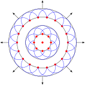
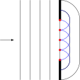
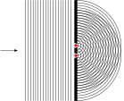
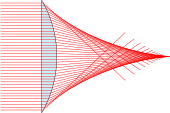
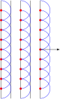
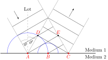
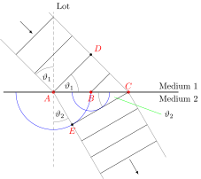

# List of tikz images
## circular-polarized-wave.svg

~~~.tex
\documentclass[crop,tikz]{standalone}

\tikzset{>=latex}

\begin{document}
\begin{tikzpicture}[x={(-10:1cm)},y={(90:1cm)},z={(210:1cm)}]
  % axis
  \draw[->] (-1,0,0) -- (5,  0,0) node[above] {$z$};
  \draw[->] ( 0,0,0) -- (0,1.5,0) node[above] {$x$};
  \draw[->] ( 0,0,0) -- (0,0,1.5) node[left ] {$y$};
  % propagation
  \draw[->,ultra thick] (6,0,0) -- (7,0,0);
  % waves
  \draw[blue,thick] plot[domain=0:4.5,samples=200] (\x,{cos(deg(pi*\x))},{-sin(deg(pi*\x))});
  \draw[red ,thick] plot[domain=0:4.5,samples=200] (\x,{sin(deg(pi*\x))},{cos(deg(pi*\x))});
  % arrows
  \foreach \x in {0.1,0.2,...,4.4} {
    \draw[->,help lines,blue] (\x,0,0) -- (\x,{cos(deg(pi*\x))},{-sin(deg(pi*\x))});
    \draw[->,help lines,red ] (\x,0,0) -- (\x,{sin(deg(pi*\x))},{cos(deg(pi*\x))});
  }
  % labels
  \node[blue,above right] at (0,1.2,0) {$\vec{E}$};
  \node[red,below] at (0,0,1) {$\vec{B}$};
\end{tikzpicture}
\end{document}
~~~
## linear-polarized-wave.svg

~~~.tex
\documentclass[crop,tikz]{standalone}

\tikzset{>=latex}

\begin{document}
\begin{tikzpicture}[x={(-10:1cm)},y={(90:1cm)},z={(210:1cm)}]
  % axis
  \draw[->] (-1,0,0) -- (5,  0,0) node[above] {$z$};
  \draw[->] ( 0,0,0) -- (0,1.5,0) node[above] {$x$};
  \draw[->] ( 0,0,0) -- (0,0,1.5) node[left ] {$y$};
  % propagation
  \draw[->,ultra thick] (6,0,0) -- (7,0,0);
  % waves
  \draw[blue,thick] plot[domain=0:4.5,samples=200] (\x,{cos(deg(pi*\x))},0);
  \draw[red ,thick] plot[domain=0:4.5,samples=200] (\x,0,{cos(deg(pi*\x))});
  % arrows
  \foreach \x in {0.1,0.3,...,4.4} {
    \draw[->,help lines,blue] (\x,0,0) -- (\x,{cos(deg(pi*\x))},0);
    \draw[->,help lines,red ] (\x,0,0) -- (\x,0,{cos(deg(pi*\x))});
  }
  % labels
  \node[blue,above right] at (0,1,0) {$\vec{E}$};
  \node[red,below] at (0,0,1) {$\vec{B}$};
\end{tikzpicture}
\end{document}
~~~
## space-point-2-delta.svg

~~~.tex
\documentclass[crop,tikz]{standalone}

\tikzset{>=latex}
\usetikzlibrary{calc,decorations.markings}
\newcommand{\place}{\vec{r}}
\newcommand{\ex}{\vec{e}_x}
\newcommand{\ey}{\vec{e}_y}
\newcommand{\ez}{\vec{e}_z}

\begin{document}
\begin{tikzpicture}[scale=1.3]
  % axes
  \draw[->,thick] (xyz cs:x=-0.5) -- (xyz cs:x=4)  node[below] {$x$};
  \draw[->,thick] (xyz cs:y=-0.5) -- (xyz cs:y=3)  node[left] {$z$};
  \draw[->,thick] (xyz cs:z=1)    -- (xyz cs:z=-4) node[above] {$y$};
  % path
  \draw[thick,
        decoration={markings, mark=at position 0.5 with {\arrow{>}}},
        postaction={decorate},
        black!40!green]
       (xyz cs:x=1,y=2.5,z=0) arc (90:0:2);
  % space point
  \coordinate (r1) at ($(1,0.5)+(70:2)$);
  \coordinate (r2) at ($(1,0.5)+(20:2)$);
  \draw[->,thick,red]  (xyz cs:x=0) -- node[above,xshift=-1em]{$\place(t_1)$} (r1);
  \draw[->,thick,blue] (xyz cs:x=0) -- node[below,xshift=+1em]{$\place(t_2)$} (r2);
  % delta r
  \draw[->,thick,dashed] (r1) -- node[below,anchor=east,xshift=0.5em,yshift=-1em]{$\Delta\place$} (r2);
\end{tikzpicture}
\end{document}
~~~
## space-point-2.svg

~~~.tex
\documentclass[crop,tikz]{standalone}

\tikzset{>=latex}
\usetikzlibrary{calc,decorations.markings}
\newcommand{\place}{\vec{r}}
\newcommand{\ex}{\vec{e}_x}
\newcommand{\ey}{\vec{e}_y}
\newcommand{\ez}{\vec{e}_z}

\begin{document}
\begin{tikzpicture}[scale=1.3]
  % axes
  \draw[->,thick] (xyz cs:x=-0.5) -- (xyz cs:x=4)  node[below] {$x$};
  \draw[->,thick] (xyz cs:y=-0.5) -- (xyz cs:y=3)  node[left] {$z$};
  \draw[->,thick] (xyz cs:z=1)    -- (xyz cs:z=-4) node[above] {$y$};
  % path
  \draw[thick,
        decoration={markings, mark=at position 0.5 with {\arrow{>}}},
        postaction={decorate},
        black!40!green]
       (xyz cs:x=1,y=2.5,z=0) arc (90:0:2);
  % space point
  \coordinate (r1) at ($(1,0.5)+(70:2)$);
  \coordinate (r2) at ($(1,0.5)+(20:2)$);
  \draw[->,thick,red]  (xyz cs:x=0) -- node[above,xshift=-1em]{$\place(t_1)$} (r1);
  \draw[->,thick,blue] (xyz cs:x=0) -- node[below,xshift=+1em]{$\place(t_2)$} (r2);
\end{tikzpicture}
\end{document}
~~~
## space-point.svg

~~~.tex
\documentclass[crop,tikz]{standalone}

\tikzset{>=latex}
\newcommand{\place}{\vec{r}}
\newcommand{\ex}{\vec{e}_x}
\newcommand{\ey}{\vec{e}_y}
\newcommand{\ez}{\vec{e}_z}

\begin{document}
\begin{tikzpicture}[scale=1.3]
  % axes
  \draw[->,thick] (xyz cs:x=-0.5) -- (xyz cs:x=4)  node[below] {$x$};
  \draw[->,thick] (xyz cs:y=-0.5) -- (xyz cs:y=3)  node[left]  {$z$};
  \draw[->,thick] (xyz cs:z=1)    -- (xyz cs:z=-4) node[above] {$y$};
  % dashed lines
  \draw[dashed] (xyz cs:x=3)  -- ++(xyz cs:z=-2) -- ++(xyz cs:y=2) coordinate (p) node[above] {$P(x,y,z)$};
  \draw[dashed] (xyz cs:z=-2) -- ++(xyz cs:x=3);
  \draw[dashed] (xyz cs:x=0,y=2,z=0) -- ++(xyz cs:x=3) -- ++(xyz cs:z=-2) -- ++(xyz cs:x=-3) -- ++(xyz cs:z=2);
  \draw[dashed] (xyz cs:x=3)  -- ++(xyz cs:y=2);
  \draw[dashed] (xyz cs:z=-2) -- ++(xyz cs:y=2);
  \node[fill,circle,inner sep=1.5pt] at (p) {};
  % point
  \draw[->,very thick,red,shorten >= 0.5mm] (xyz cs:x=0) -- node[below]{$\place$} (xyz cs:x=3,y=2,z=-2);
  % unit vectors
  \draw[->,very thick,blue] (xyz cs:x=0) -- node[below]{$\ex$} (xyz cs:x=1);
  \draw[->,very thick,blue] (xyz cs:x=0) -- (xyz cs:z=-1) node[left,yshift=0.6em,xshift=0.3em]{$\ey$};
  \draw[->,very thick,blue] (xyz cs:x=0) -- node[left]{$\ez$} (xyz cs:y=1);
\end{tikzpicture}
\end{document}
~~~
## aperture.svg

~~~.tex
\documentclass[crop,tikz]{standalone}

\tikzset{>=latex}
\usetikzlibrary{calc}

\begin{document}
\begin{tikzpicture}
  % rays
  \foreach \d in { -20,-19,...,-2 } { \draw[->,red] (0,0) -- +(\d:{4/cos(\d)}); };
  \foreach \d in {  20, 19,..., 2 } { \draw[->,red] (0,0) -- +(\d:{4/cos(\d)}); };
  \foreach \d in { -1, 0, 1       } { \draw[->,red] (0,0) -- +(\d:6); };
  % aperture
  \draw[fill] (4-0.05,-1.6) rectangle (4+0.05,-0.1);
  \draw[fill] (4-0.05, 0.1) rectangle (4+0.05, 1.6);
  % description
  \draw[]   ($( 1:6)+(0.1,0)$) -- +(0.2,0);
  \draw[]   ($(-1:6)+(0.1,0)$) -- +(0.2,0);
  \draw[->] ($( 1:6)+(0.2, 0.5)$) -- +(0,-0.5);
  \draw[->] ($(-1:6)+(0.2,-0.5)$) -- +(0, 0.5);
  \node[right] at (0:6.3) {$b$};
\end{tikzpicture}
\end{document}
~~~
## circular-wave-fronts.svg

~~~.tex
\documentclass[crop,tikz]{standalone}

\tikzset{>=latex}

\begin{document}
\begin{tikzpicture}
  \foreach \R in {0.5,1,1.5,2} { \draw (0,0) circle (\R); }
  \foreach \R in {0.5} {%
    \foreach \A in {0,45,...,315} {%
      \draw[blue] (\A:\R)+(\A-120:0.5) arc (\A-120:\A+120:0.5);
      \draw[fill,red] (\A:\R) circle (0.05);
    }
  }
  \foreach \R in {1.5} {%
    \foreach \A in {0,20,...,340} {%
      \draw[blue] (\A:\R)+(\A-100:0.5) arc (\A-100:\A+100:0.5);
      \draw[fill,red] (\A:\R) circle (0.05);
    }
  }
  \foreach \X in {0,45,...,315} { \draw[->] (\X:2) -- +(\X:0.5); }
  \draw[fill,red] (0,0) circle (0.05);
\end{tikzpicture}
\end{document}
~~~
## diffraction-single-slit.svg

~~~.tex
\documentclass[crop,tikz]{standalone}

\tikzset{>=latex}
\usetikzlibrary{calc}

\begin{document}
\begin{tikzpicture}
  % slit
  \draw[fill] (-0.1, 1.05) rectangle (0.1, 2.0);
  \draw[fill] (-0.1,-1.05) rectangle (0.1,-2.0);
  % rays
  \foreach \Y in {-1,-0.8,...,1} {%
    \draw[fill,red] (0,\Y) circle (0.05);
    \draw[->,red] (0,\Y) -- +(20:{3+(1-\Y)*sin(20)});
  };
  \node at (20:4) {$P$};
  \draw[dashed] (-0.7,-1) -- (1.3,-1);
  \draw[blue] (0,-1)+(0:1) arc (0:20:1);
  \node[blue] at ($(0,-1)+(10:1.2)$) {$\vartheta$};
  \draw[<->] (-2,-1) -- node[left] {$b$} +(0,2);
  % triangle
  \draw[thick] (0,1) -- +(-70:{2*cos(20)}) -- (0,-1);
  \draw[thick] (0,1)+(-70:{cos(20)}) -- (0,0);
  \draw[gray] (0,-1)+(20:0.4) -- +(-30:1) node[below,black] {$\Delta s$};
  \draw[gray] (0,0)+(20:0.2) -- +(130:1) node[left,black] {$\displaystyle\frac{\Delta s}{2}$};
\end{tikzpicture}
\end{document}
~~~
## huygens-aperture.svg

~~~.tex
\documentclass[crop,tikz]{standalone}

\tikzset{>=latex}

\begin{document}
\begin{tikzpicture}
  \foreach\X in {-2,-1.5,-1,-0.5,0} {\draw(\X,-2)--(\X,2);}
  \draw[->] (-3,0) -- +(0.7,0);
  \draw[fill] (0.05,-2) rectangle (-0.05,-1);
  \draw[fill] (0.05,2)  rectangle (-0.05,1);
  \foreach\Y in {-1,-0.5,...,1} {%
    \draw[fill,red] (0,\Y) circle (0.05);
    \draw[blue] (0,\Y)+(-90:0.5) arc (-90:+90:0.5);
  }
  \draw (0,-1.5) arc (-90:0:0.5) -- (0.5,1) arc (0:90:0.5);
  \draw (0,-2)   arc (-90:0:1)   -- (1,1)   arc (0:90:1);
\end{tikzpicture}
\end{document}
~~~
## huygens-double-slit.svg

~~~.tex
\documentclass[crop,tikz]{standalone}

\tikzset{>=latex}

\usetikzlibrary{decorations.pathreplacing}

\begin{document}
\begin{tikzpicture}
  % direction
  \draw[->] (-3,0) -- +(0.7,0);
  % plain waves
  \foreach\X in {-2,-1.9,...,-0.1} {\draw(\X,-2)--(\X,2);}
  % aperture
  \draw[fill] (0.05,-2) rectangle (-0.05,-0.3);
  \draw[fill] (0.05,-0.1) rectangle (-0.05,0.1);
  \draw[fill] (0.05,2)  rectangle (-0.05,0.3);
  % coordinates
  \coordinate (a) at (0,0.2);
  \coordinate (b) at (0,-0.2);
  % red dots
  \draw[fill,red] (a) circle (0.05);
  \draw[fill,red] (b) circle (0.05);
  % circular waves
  \draw[decoration={expanding waves,angle=90,segment length=0.1cm},decorate] (a) -- +(1.9,0);
  \draw[decoration={expanding waves,angle=90,segment length=0.1cm},decorate] (b) -- +(1.9,0);
\end{tikzpicture}
\end{document}
~~~
## lens-diacaustic.svg

~~~.tex
\documentclass[crop,tikz]{standalone}

\begin{document}
\begin{tikzpicture}
  \pgfmathsetmacro{\radius}{4}
  \pgfmathsetmacro{\refractiveindex}{2}
  \draw[fill=cyan!20] (-30:\radius) arc (-30:30:\radius) -- cycle;
  \foreach \Y in { -1.9,-1.8,...,1.9 } {%
    \pgfmathsetmacro{\X}{sqrt(\radius*\radius-\Y*\Y)}
    \pgfmathsetmacro{\angle}{atan(\Y/\X)}
    \draw[red] (2, \Y) -- ({\X}, \Y) -- +({\angle - asin(\refractiveindex*sin(\angle))}:4);
  }
\end{tikzpicture}
\end{document}
~~~
## lens-paraxial.svg

~~~.tex
\documentclass[crop,tikz]{standalone}

\begin{document}
\begin{tikzpicture}
  \pgfmathsetmacro{\radius}{4}
  \pgfmathsetmacro{\refractiveindex}{2}
  \draw[fill=cyan!20] (-30:\radius) arc (-30:30:\radius) -- cycle;
  \foreach \Y in { -0.4,-0.3,...,0.4 } {%
    \pgfmathsetmacro{\X}{sqrt(\radius*\radius-\Y*\Y)}
    \pgfmathsetmacro{\angle}{atan(\Y/\X)}
    \draw[red] (2, \Y) -- ({\X}, \Y) -- +({\angle - asin(\refractiveindex*sin(\angle))}:5);
  }
\end{tikzpicture}
\end{document}
~~~
## mirror-catacaustic.svg

~~~.tex
\documentclass[crop,tikz]{standalone}

\begin{document}
\begin{tikzpicture}
  \pgfmathsetmacro{\radius}{4}
  \draw (-90:\radius) arc (-90:90:\radius);
  \foreach \Y in { -3.7,-3.6,...,3.7 } {%
    \pgfmathsetmacro{\X}{sqrt(\radius*\radius-\Y*\Y)}
    \draw[red] (-\radius/2, \Y) -- ({\X}, \Y) -- +({180+2*atan(\Y/\X)}:3);
  }
\end{tikzpicture}
\end{document}
~~~
## mirror-parabolic.svg

~~~.tex
\documentclass[crop,tikz]{standalone}

\usepackage{pgfplots}
\pgfplotsset{compat=1.16}

\begin{document}
\begin{tikzpicture}
  \begin{axis}[
    domain={-sqrt(2)}:{sqrt(2)},
    samples=100,
    axis y line=middle,
    axis x line=middle,
    axis line style={draw=none},
    tick style={draw=none},
    xticklabels=\empty,
    yticklabels=\empty,
    clip=false
    ]
    \addplot[smooth] (-x*x,x);
    \pgfplotsinvokeforeach{1.4,1.3,...,-1.4}{%
      \draw[red] (axis cs:-2.5,#1) -- (axis cs:{-#1*#1},#1) -- (axis cs:-0.25,0);
    }
  \end{axis}
\end{tikzpicture}
\end{document}
~~~
## plancks-law.svg

~~~.tex
\documentclass[crop,tikz]{standalone}

\usepackage{amsmath}
\usepackage{pgfplots}
\usepackage{pgfplotstable}
\tikzset{>=latex}
\pgfplotsset{compat=1.16}

% rainbow line
\pgfdeclareverticalshading{rainbow}{100bp}
{color(0bp)=(red); color(25bp)=(red); color(35bp)=(yellow);
color(45bp)=(green); color(55bp)=(cyan); color(65bp)=(blue);
color(75bp)=(violet); color(100bp)=(violet)}

\begin{document}
\begin{tikzpicture}
  % data generated with: data/strahlungsspektrum.m
  \pgfplotstableread{data/T300K.dat}\tableThreeHoundred
  \pgfplotstableread{data/T500K.dat}\tableFiveHoundred
  \pgfplotstableread{data/T1000K.dat}\tableOneThousand
  \pgfplotstableread{data/T3000K.dat}\tableThreeThousand
  \pgfplotstableread{data/T5777K.dat}\tableFiveThousand
  \pgfplotstableread{data/T10000K.dat}\tableTenThousand
  \pgfplotstableread{data/wien.dat}\tableWien
  \begin{loglogaxis}[
    axis on top, % axis before the rectangle
    width=10cm,
    height=8cm,
    xmin=0.1, xmax=100,
    ymin=1e-2, ymax=1e10,
    xlabel={$\lambda/\mu\text{m}$},
    ylabel={$S_\lambda(\lambda)/(\text{W}\,\text{m}^{-2}\,\mu\text{m}^{-1})$}
    ]
    % light band
    \shade[shading=rainbow,shading angle=90,opacity=0.2] (axis cs:0.38,1e-2) rectangle (axis cs:0.78,1e10);
    % intensities
    \addplot[thick]     table [x index=0, y index=1] {\tableThreeHoundred};
    \addplot[thick]     table [x index=0, y index=1] {\tableFiveHoundred};
    \addplot[thick]     table [x index=0, y index=1] {\tableOneThousand};
    \addplot[thick]     table [x index=0, y index=1] {\tableThreeThousand};
    \addplot[thick,red] table [x index=0, y index=1] {\tableFiveThousand};
    \addplot[thick]     table [x index=0, y index=1] {\tableTenThousand};
    % temperatures
    \node[rotate=66,font=\small,anchor=west] at (2.8 ,2e-2) {$300\,\text{K}$};
    \node[rotate=70,font=\small,anchor=west] at (1.4 ,2e-2) {$500\,\text{K}$};
    \node[rotate=75,font=\small,anchor=west] at (0.6 ,2e-2) {$1000\,\text{K}$};
    \node[rotate=77,font=\small,anchor=west] at (0.16,2e-2) {$3000\,\text{K}$};
    \node[rotate=70,font=\small,red]         at (0.15,1e+5) {$5777\,\text{K}$};
    \node[rotate=40,font=\small]             at (0.18,5e+8) {$10000\,\text{K}$};
    % Wien's displacement law
    \addplot[blue,thick,dashed] table [x index=0, y index=1] {\tableWien};
    \draw[->,blue] (rel axis cs: 0.95,0.95) node[above,anchor=north east,align=center,fill=white] {Wien'sches\\ Verschiebungsgesetz} -- (2.5,2e5);
  \end{loglogaxis}
\end{tikzpicture}
\end{document}
~~~
## plane-wave-fronts.svg

~~~.tex
\documentclass[crop,tikz]{standalone}

\tikzset{>=latex}

\begin{document}
\begin{tikzpicture}
  \foreach \X in {0,0.5,1,1.5,2} { \draw (\X,0) -- +(0,5); }
  \foreach \X in {0,1,2} {%
    \foreach \Y in {0.5,1,...,4.5} {%
      \draw[blue] (\X,\Y)+(-90:0.5) arc (-90:90:0.5);
      \draw[fill,red] (\X,\Y) circle (0.05);
    }
  }
  \draw[->] (2,2.5) -- +(1,0);
\end{tikzpicture}
\end{document}
~~~
## reflection-law.svg

~~~.tex
\documentclass[crop,tikz]{standalone}

\tikzset{>=latex}
\usetikzlibrary{calc}

% Centered arc
% Syntax: [draw options] (center) (initial angle:final angle:radius)
\def\centerarc[#1](#2)(#3:#4:#5);%
{
  \draw[#1]([shift=(#3:#5)]#2) arc (#3:#4:#5);
}

\begin{document}
\begin{tikzpicture}
  \coordinate (a) at (1,0);
  \coordinate (b) at (2.5,0);
  \coordinate (c) at (4,0);
  % boundary
  \draw[thick] (-1,0) -- +(7,0) node[above] {Medium $1$} node[below] {Medium $2$};
  % plumb
  \draw[gray,dashed] (a) -- +(0,3) node[above,black] {Lot};
  \centerarc[gray](a)(90:120:1);
  \node[below] at ($(a)+(100:1)+(0,-0.08)$) {$\vartheta$};
  \centerarc[gray](a)(60:90:1.2);
  \node[below] at ($(a)+(80:1.2)+(0.05,-0.1)$) {$\vartheta'$};
  % elementary wave
  \draw[fill,red] (a) circle (0.05) node[below] {$A$};
  \centerarc[blue](a)(180:0:0.5*3);
  % elementary wave
  \draw[fill,red] (b) circle (0.05) node[below] {$B$};
  \centerarc[blue](b)(180:0:0.5*1.5);
  % elementary wave
  \draw[fill,red] (c) circle (0.05) node[below] {$C$};
  % wave fronts
  \draw[] (a) -- +(30:0.866*3);
  \draw[] (b) -- +(30:0.866*1.5);
  \foreach \X in {1,2,3} { \draw ($(a)+(120:0.5*1.5*\X)$) -- +(30:0.866*3); };
  \foreach \X in {0,1,2,3} { \draw ($(c)+(60:0.5*1.5*\X)$) -- +(150:0.866*3); };
  % boundary
  \draw[gray] (a) -- +(120:3);
  \draw[gray] (a) -- +(60:3+0.5*3);
  \draw[gray] (c) -- +(120:3+0.5*3);
  \draw[gray] (c) -- +(60:3+0);
  % arrows
  \draw[->] (0,3.1) -- +(-60:0.7);
  \draw[->] ($(b)+(60:3.1)$) -- +(60:0.7);
  % points
  \coordinate (d) at ($(c)+(150:0.866*3)$);
  \coordinate (e) at ($(a)+(30:0.866*3)$);
  \draw[fill] (d) circle (0.04);
  \draw[fill] (e) circle (0.04);
  \node[above,red] at (d) {$D$};
  \node[above,red] at (e) {$E$};
\end{tikzpicture}
\end{document}
~~~
## refraction-law.svg

~~~.tex
\documentclass[crop,tikz]{standalone}

\tikzset{>=latex}
\usetikzlibrary{calc}

% Centered arc
% Syntax: [draw options] (center) (initial angle:final angle:radius)
\def\centerarc[#1](#2)(#3:#4:#5);%
{
  \draw[#1]([shift=(#3:#5)]#2) arc (#3:#4:#5);
}

\begin{document}
\begin{tikzpicture}
  \coordinate (a) at (1,0);
  \coordinate (b) at (2.5,0);
  \coordinate (c) at (4,0);
  % boundary
  \draw[thick] (-1,0) -- +(7,0) node[above] {Medium $1$} node[below] {Medium $2$};
  % plumb
  \draw[gray,dashed] (a) -- +(0,3.2) node[above right,black] {Lot} -- +(0,-3);
  \centerarc[gray](a)(90:135:1);
  \node[below] at ($(a)+(105:1)+(0,-0.1)$) {$\vartheta_1$};
  \centerarc[gray](a)(0:45:1);
  \node[left] at ($(a)+(20:1)+(0,-0.1)$) {$\vartheta_1$};
  \centerarc[gray](a)(-60:-90:1.2);
  \node[above] at ($(a)+(-75:1.3)+(-0.08,0.1)$) {$\vartheta_2$};
  \centerarc[gray](c)(180:210:1.2);
  \draw[green] ($(c)+(200:0.6)$) -- +(-20:2) node[right,black] {$\vartheta_2$};
  % elementary wave
  \draw[fill,red] (a) circle (0.05) node[below left] {$A$};
  \centerarc[blue](a)(180:360:0.5*3);
  % elementary wave
  \draw[fill,red] (b) circle (0.05) node[below] {$B$};
  \centerarc[blue](b)(180:360:0.5*1.5);
  % elementary wave
  \draw[fill,red] (c) circle (0.05) node[above] {$C$};
  % wave fronts
  \draw[] (a) -- +(45:0.707*3);
  \draw[] (b) -- +(45:0.707*1.5);
  \foreach \X in {1,2} { \draw ($(a)+(135:0.707*1.5*\X)$) -- +(45:0.707*3); };
  \foreach \X in {0,1,2,3} { \draw ($(c)+(-60:0.5*1.5*\X)$) -- +(-150:0.866*3); };
  % border
  \draw[gray] (a) -- +(135:3);
  \draw[gray] (a) -- +(-60:3+0.5*2);
  \draw[gray] (c) -- +(135:3+0.5*3);
  \draw[gray] (c) -- +(-60:3);
  % arrows
  \draw[->] ($(b)+(135:4)$) -- +(-45:0.7);
  \draw[->] ($(b)+(-60:3.1)$) -- +(-60:0.7);
  % points
  \coordinate (d) at ($(c)+(135:0.707*3)$);
  \coordinate (e) at ($(a)+(-60:1.5*0.5*2)$);
  \draw[fill] (d) circle (0.04);
  \draw[fill] (e) circle (0.04);
  \node[above right,red] at (d) {$D$};
  \node[below,red] at (e) {$E$};
\end{tikzpicture}
\end{document}
~~~
## thin-layer.svg

~~~.tex
\documentclass[crop,tikz]{standalone}

\tikzset{>=latex}
\usetikzlibrary{calc}

\begin{document}
\begin{tikzpicture}
  \draw[fill,cyan!20] (110:10) arc (110:70:10) -- (70:9) arc (70:110:9) -- cycle;
  \coordinate (a) at (92:10);
  \coordinate (b) at (90:9);
  \coordinate (c) at (88:10);
  \draw[->,red] (a)+(135:1) -- (a) -- ($(a)+(45:1)$);
  \draw[->,red] (a) -- (b);
  \draw[->,red] (b) -- (c);
  \draw[->,red] (c) -- ($(c)+(45:1)$);
  \draw[->,red,dashed] (b) -- ($(b)+(-45:1)$);
  \draw[->,red,dashed] (c) -- (86:9);
\end{tikzpicture}
\end{document}
~~~
